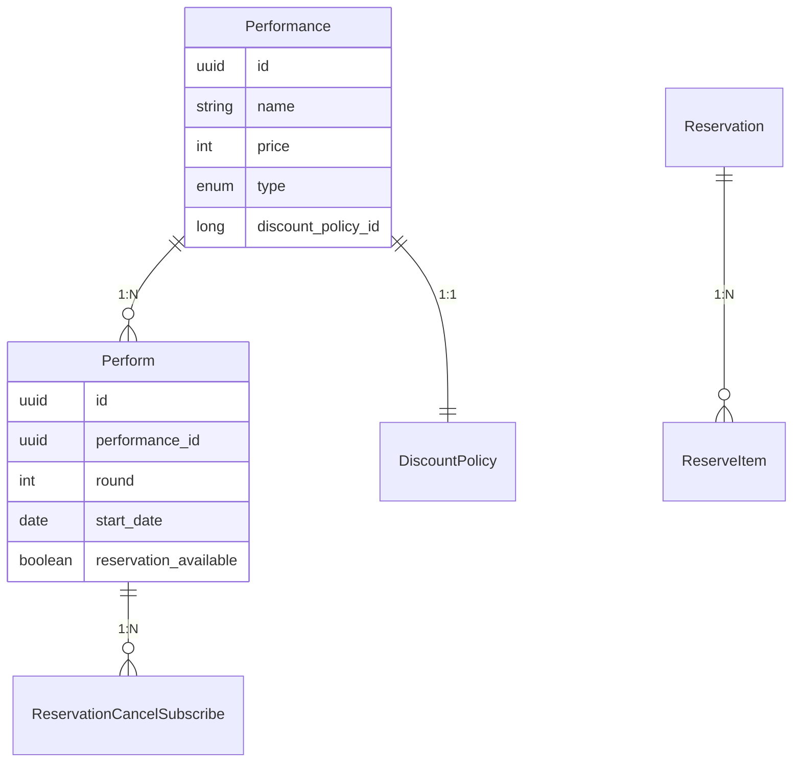
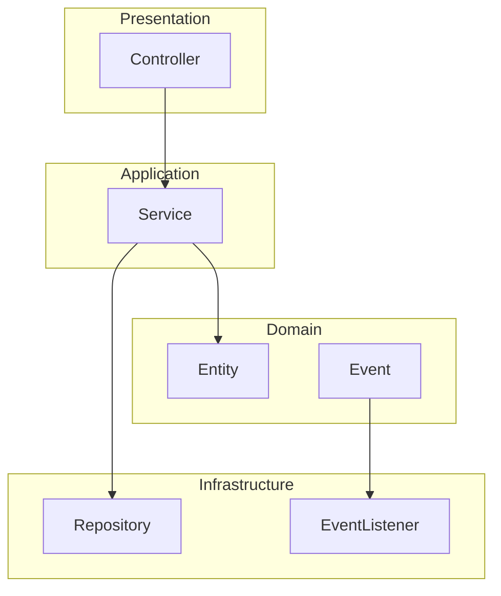
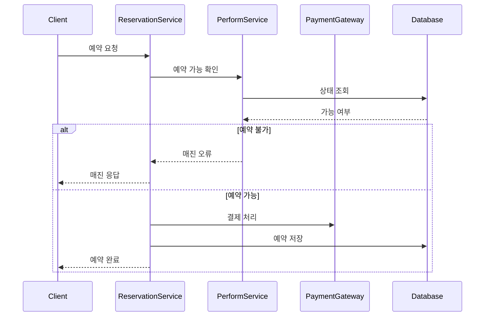
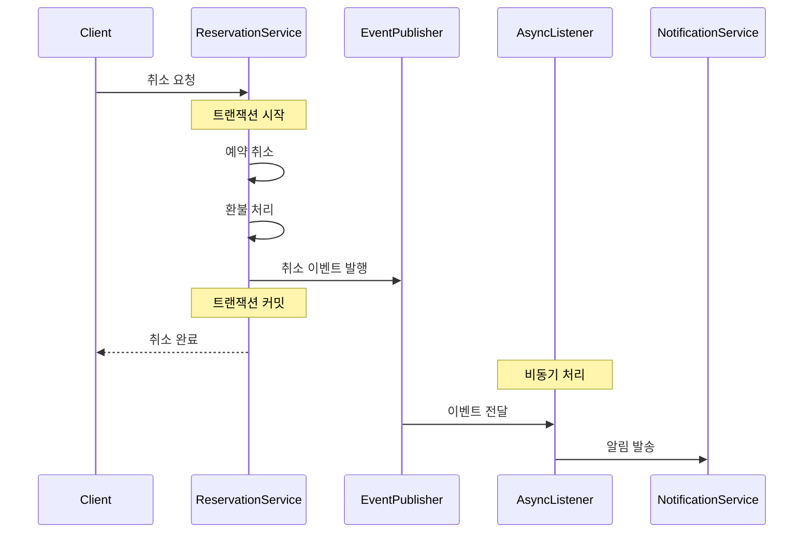
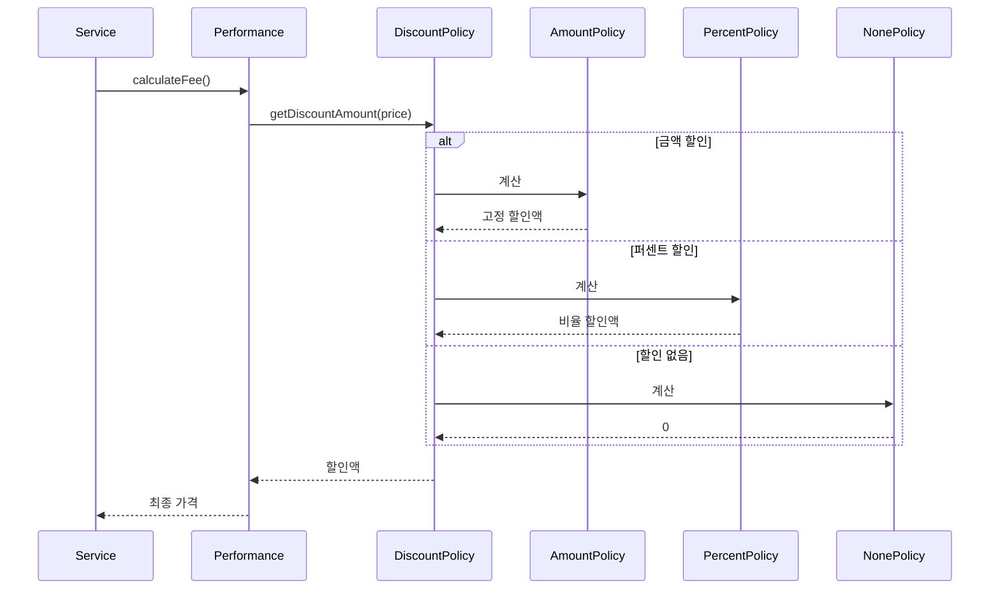
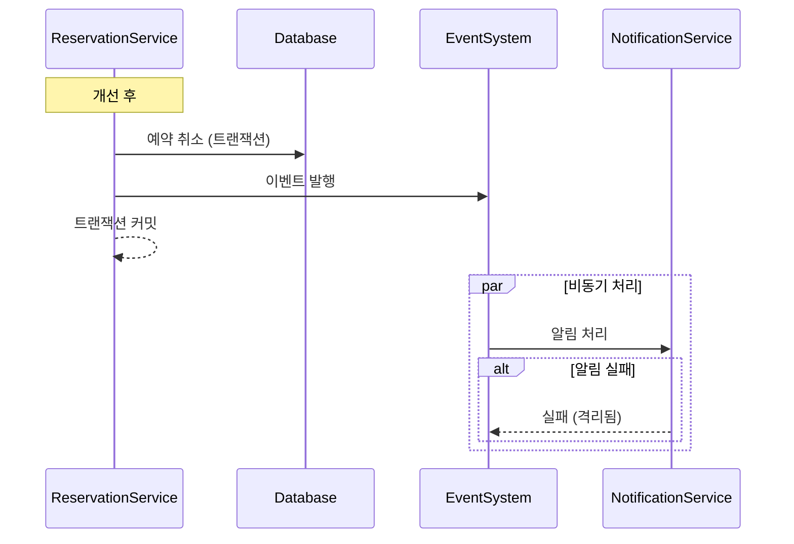
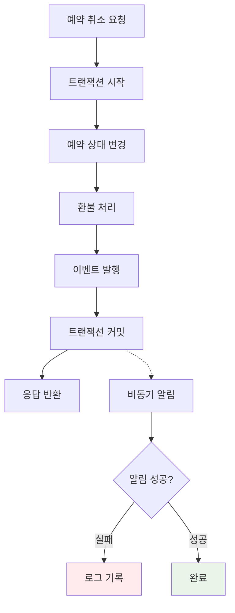

# 공연/전시 예약 시스템

> Spring Boot 기반 예약 시스템 구현 및 코드리뷰 경험

[](https://openjdk.java.net/projects/jdk/17/)
[](https://spring.io/projects/spring-boot)
[](https://hibernate.org/)

##  목차
1. [구현한 기능](#구현한-기능)
2. [아키텍처 설계](#아키텍처-설계)
3. [주요 플로우](#주요-플로우)
4. [코드리뷰 경험](#코드리뷰-경험)
5. [기술적 문제와 해결](#기술적-문제와-해결)
6. [아쉬운 점과 개선사항](#아쉬운-점과-개선사항)

## 구현한 기능

**관리자**
- 공연/전시 등록
- 할인 정책 설정 (금액/퍼센트/없음)

**사용자**
- 예약 가능한 공연 목록 조회
- 공연 예약 및 취소
- 예약 내역 조회

**시스템**
- 예약 취소 시 구독자 알림 (비동기)
- 매진 처리

**기술 스택**
```
Backend: Spring Boot 3.2.1, JPA, MySQL
Test: JUnit 5, Mockito, H2
Build: Gradle
```

## 아키텍처 설계

### 도메인 구조


### Performance와 Perform을 분리한 이유
하나의 공연이 여러 회차로 진행되는 경우를 고려했습니다.
- Performance: 공연 자체 정보 (제목, 가격, 할인정책)
- Perform: 실제 상영 정보 (회차, 날짜, 예약가능여부)

이렇게 분리하면 같은 공연의 다른 회차를 독립적으로 관리할 수 있습니다.

### 레이어 구조


## 주요 플로우

### 예약 프로세스


### 예약 취소 및 알림


### 할인 정책 적용


## 코드리뷰 경험

🔗 [실제 코드리뷰](https://github.com/jinho-yoo-jack/wanted-preonboarding-challenge-backend-16/pull/22)

### 비동기 처리 개선
**문제:** 알림 발송 실패 시 예약 취소가 롤백되는 문제

**해결:**


`@TransactionalEventListener(phase = TransactionPhase.AFTER_COMMIT)`와 `@Async`를 사용해서 메인 비즈니스 로직과 알림을 분리했습니다.

### 테스트 개선
비동기 처리를 테스트하기 위해 ThreadPoolExecutor의 `awaitTermination()`을 사용했습니다.

```java
@Test
public void 알림_실패해도_예약취소는_성공() throws InterruptedException {
    // 알림 서비스에서 예외 발생하도록 설정
    doThrow(new RuntimeException()).when(notificationService).send(any());
    
    // 예약 취소 실행
    reservationService.cancel(request);
    
    // 비동기 작업 완료까지 대기
    executor.awaitTermination(1, TimeUnit.SECONDS);
    
    // 예약은 취소되어야 함
    assertThat(reservation.getStatus()).isEqualTo(CANCEL);
}
```

## 기술적 문제와 해결

### 1. 동시성 문제
**문제:** 같은 좌석에 동시 예약 요청이 들어올 때 중복 예약 가능성

**해결:** 트랜잭션 격리 수준과 예약 가능 여부 확인을 원자적으로 처리했습니다. 완전한 해결은 아니고, 실제로는 데이터베이스 락이나 Redis를 사용해야 합니다.

### 2. 이벤트 순서 보장
**문제:** 여러 이벤트가 발생할 때 처리 순서 문제

**현재:** Spring Events 사용으로 순서 보장 안 됨  
**개선 방향:** 메시지 큐 도입 시 순서 보장 필요

### 3. 실패 처리 전략


알림 실패는 비즈니스에 영향주지 않도록 격리했습니다.

## 아쉬운 점과 개선사항

### 현재 한계점
- **JPA N+1 문제**: 상속 구조로 인한 복잡한 조인 쿼리
- **동시성 제어 부족**: 실제 서비스에서는 분산 락 필요
- **테스트 커버리지**: 통합 테스트 부족
- **모니터링**: 성능 메트릭, 에러 추적 시스템 없음

### 실제로 겪은 문제들
- **데이터 정합성**: 테스트에서 트랜잭션 롤백 시 이벤트 발행 여부 확인이 어려웠음
- **비동기 테스트**: 언제 비동기 작업이 완료되는지 확인하는 방법 찾기
- **코드리뷰**: 다른 개발자와 설계 의도 공유하고 피드백 받는 과정

### 배운 점
- 비즈니스 로직과 부가 기능은 분리해야 함
- 이벤트 기반 설계는 확장성을 높이지만 복잡성도 증가
- 테스트 코드 작성이 설계 검증에 도움됨
- 코드리뷰를 통해 놓친 부분들을 발견할 수 있음

---

**참고 링크**
- [GitHub Repository](https://github.com/jinho-yoo-jack/wanted-preonboarding-challenge-backend-16)
- [Code Review](https://github.com/jinho-yoo-jack/wanted-preonboarding-challenge-backend-16/pull/22)
